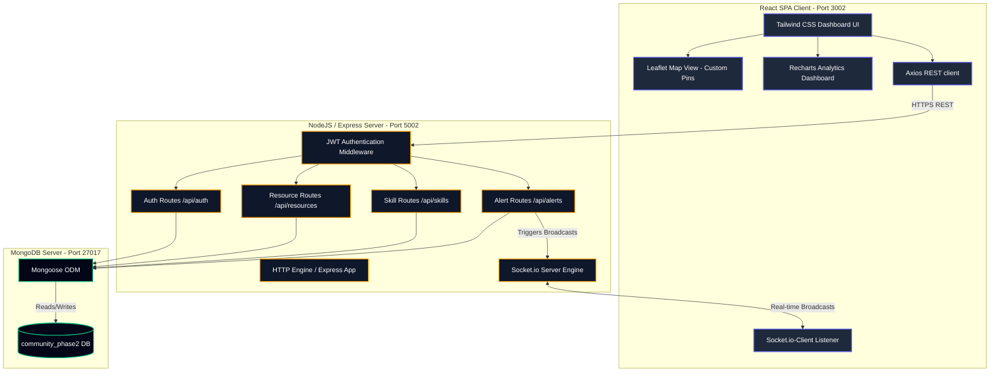

# System Architecture Diagram (Phase 2)

This document visualizes the architectural layout of the full-stack **Community Resource Sharing Platform & Neighborhood Watch Alert System** (Phase 2).

### Architectural Component Descriptions

1. **React SPA Client**: Runs a responsive dashboard built with Tailwind CSS. Incorporates **Leaflet (react-leaflet)** for displaying hazard locations on interactive dark maps, and **Recharts** to plot category distributions and resolution rates.
2. **Socket.io Connection**: Maintained concurrently between the client's `Socket.io-Client` and the server's `Socket.io Engine` over WebSocket protocol. When a new incident is submitted, the server instantly pushes the details to all connected active user sessions.
3. **JWT Authentication Layer**: Inspects incoming API requests for a valid bearer token before allowing access to mutation or query endpoints for resources, skills, and safety alerts.
4. **Mongoose & MongoDB**: Interfaces with the local MongoDB database instance to carry out operations across User, Resource, Skill, and Alert collections.
